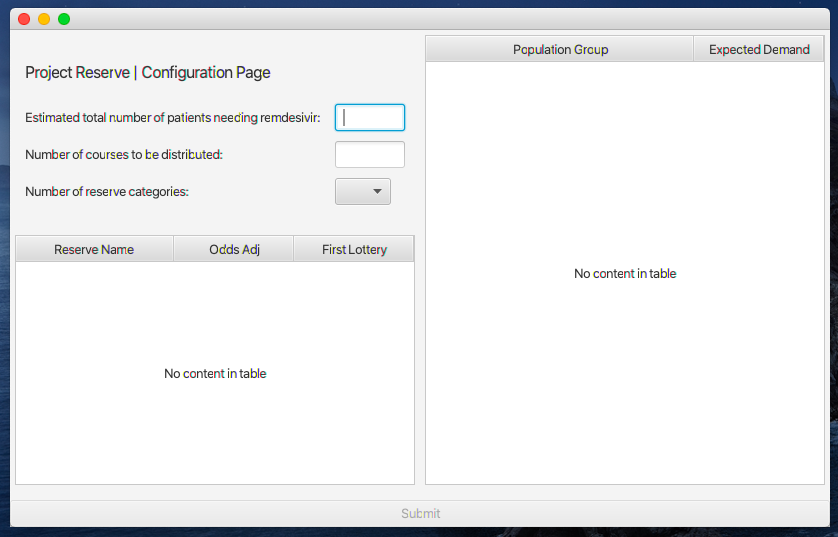
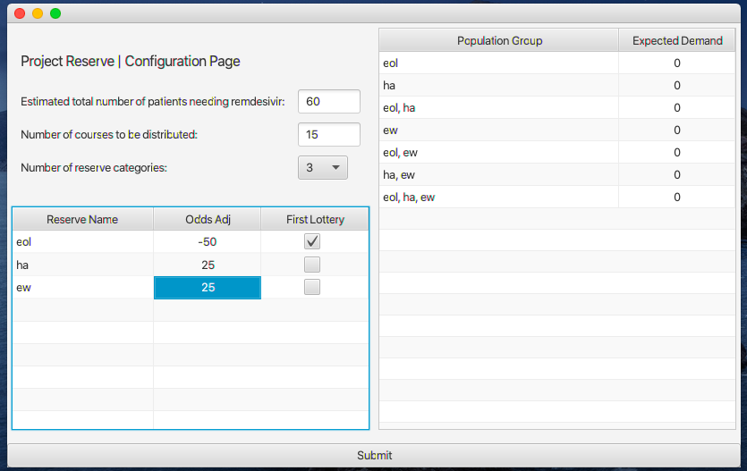
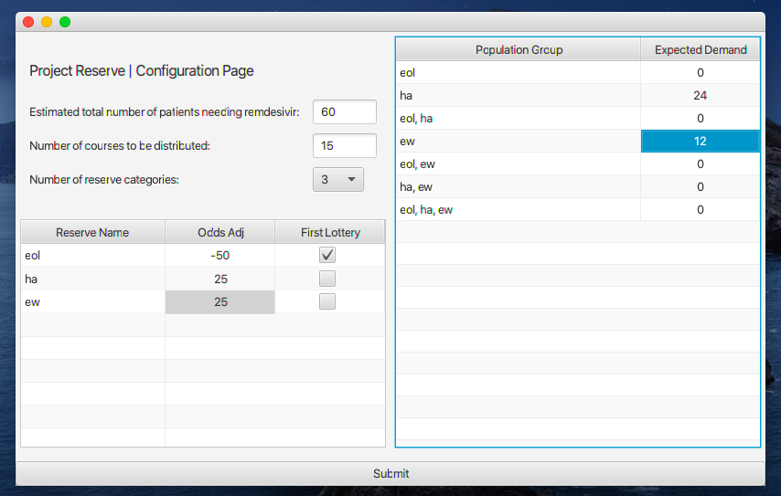
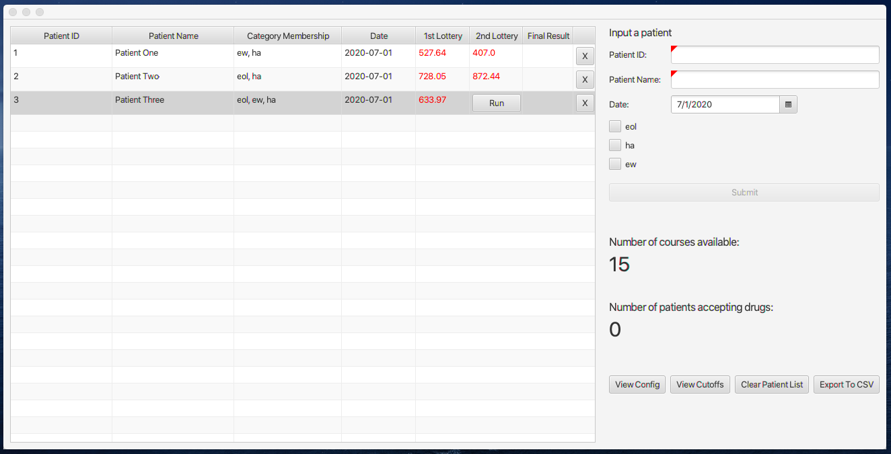

## Overview
Amidst the Covid-19 pandemic, a team of researchers circulated a [paper](http://dx.doi.org/10.2139/ssrn.3569307) proposing a reserve system as a mechanism to allocate scarce medical resources, such as the antiviral drug remdesivir, transparently while incorporating multiple priorities.
This executable program provides an implementation of such a reserve system that can be used by healthcare decision makers to allocate a limited
supply of remdesivir.

The source code for this project is available in this [github repository](https://github.com/JohnEFerguson/project-reserve).

## Installation Requirements

In order to run the executable jar, a user must have Java 8 installed
on their computer. A stable download for Java 8 is available [here](https://docs.aws.amazon.com/corretto/latest/corretto-8-ug/downloads-list.html).

The executable jar is available via this publicly available [s3 link](https://project-reserve.s3.amazonaws.com/project-reserve-0.0.2.jar)

Your computer will warn you that it is not safe to download software from unidentified developers and in order to download and run the program, you will need administrator privileges. 

## Executable Usage

Once you have the executable downloaded, drag it to your desktop or wherever you want to run the app from.

To start the executable, double click the file. You will have to grant additional permissions at this stage in order to run the program.

### Configuration

Starting the executable brings you to the configuration page which allows a user to set the main parameters of the reserve system implementation. 

#### Setting Supply and Demand

First, a user will specify how many patients they expect to seek remdesivir during their allocation session. Second, a user will specify how many courses of remdesivir there are available. Third, a user will set the number of reserve categories. The number of reserve categories is limited to a maximum of five, but a reserve system is able to accommodate a more expansive range.
#### Defining Reserve Categories

Next, a user will name each reserve category. One of these reserve categories will be the “first” reserve category, meaning it is a key component of the first lottery process. To specify one of the reserve categories as “first”, simply check the corresponding box.

When setting the reserve categories, a user can boost or handicap the chance that a patient belonging to a particular reserve category wins a lottery and receives a drug course. For example in the screenshot above, we have boosted the odds of patients that are members of the “HA” and “EW” reserve category and handicapped the odds of patients that are members of the “EOL” reserve category.

#### Specifying the Expected Demand for a Population Group

Finally, a user will specify estimates of the number of patients that will seek remdesivir for every permutation of reserve category membership. We call these permutations of reserve category membership population groups. For example in the screenshot below, a user might specify 12 as an estimate of the number of patients who will seek remdesivir that are a member of the EW reserve category, but not a member of the HA or EOL reserve category. 

Once all the configurations are complete, you can click “Submit” and proceed to the lottery stage of the process.

### Patient Input

The next page is the main lottery page. Here, a user can add patients, run the lottery to determine if each added patient will receive the drug or not, view configuration and cutoff data, and export the list of patients processed.

#### Adding a Patient

Enter in the patient ID, patient name, date, and check the boxes of the relevant reserve categories that a patient falls under. If you make a mistake in adding a patient, there is a delete button that appears next to the added patient allowing a user to delete an entered patient from the patient history.

#### Running the Lottery

Once a patient is added, they will be displayed on the left pane, or the patient list. Assuming there is still drug supply available, a user will have the opportunity to run the lottery for the added patient. If there is drug supply remaining, any patient can run the first lottery stage by clicking the “Run” button under the First Lottery column. A random number between 0 and 1000 will then be drawn and is printed in the 1st Lottery column. The color indicates a win or a loss: text colored red represents a loss and text colored green represents a win. Winning or losing the first lottery stage is based on the first lottery cutoffs, which are calculated based on the initial configuration settings. You can click the “View Cutoffs” button to see the cutoffs for the first lottery stage.

#### Handling Lottery Results

If a patient wins the lottery, they will have the opportunity to accept their course of drug by clicking the “Accept” button. The numbers in the lower right hand side will update to reflect that a patient has accepted a course of drug.

If a patient loses the first lottery, they might qualify for a second lottery depending on the reserve categories that they belong to. If a patient loses the first lottery and qualifies for a second lottery, the patient will see a new “Run” button appear and clicking it will draw another random number between 0 to 1000. As before, the color of the number reflects whether the lottery resulted in a win or a loss and winning the lottery is defined by comparing the random number to the second lottery cutoffs.

The buttons on the lower right-hand corner of the page allow the user to view the initial configuration, lottery cutoffs, clear the current patient data entered, and export the data entered to a csv file export.

#### Exporting Data

If a user wants to save the data entered, they can press the "Export to CSV" button. Doing so will
generate a csv file that will be saved in the directory where the executable program was initially run. The csv contains all of the configurations, lottery cutoffs, and patient results for the program session at the time the “Export to CSV” button was pressed. Notably, the csv naming conventions are such that it is impossible to accidentally overwrite a previous data export. The file name of the export is:

`[date]_[time]_project_reserve_patient_export.csv`

If a user wishes to restart their processing of patients, they can click “Clear Patient List” and the database of added patients will be permanently deleted. It is highly recommended that a user export the patient list before clearing the patient list to avoid loss of data.

If a user wishes to change the initial configuration settings, they will need to restart the application. The best practice in this scenario is to export the patient list to a csv file to save progress, close the application, and finally reopen the application.
 
## Issues
 
If you have an issue running the program, feel free to reach out to the maintainers. Their contacts are listed below:

* Jack Ferguson (john.everett.ferguson@gmail.com)
* Chetan Patel (cpatel@mit.edu)